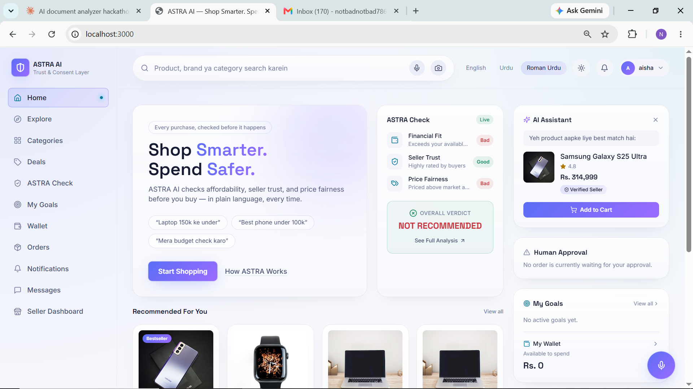
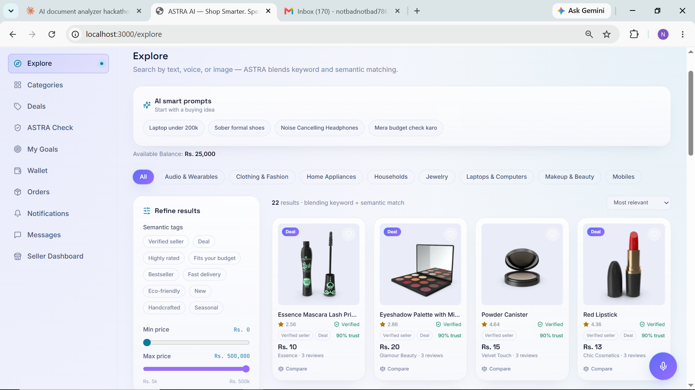
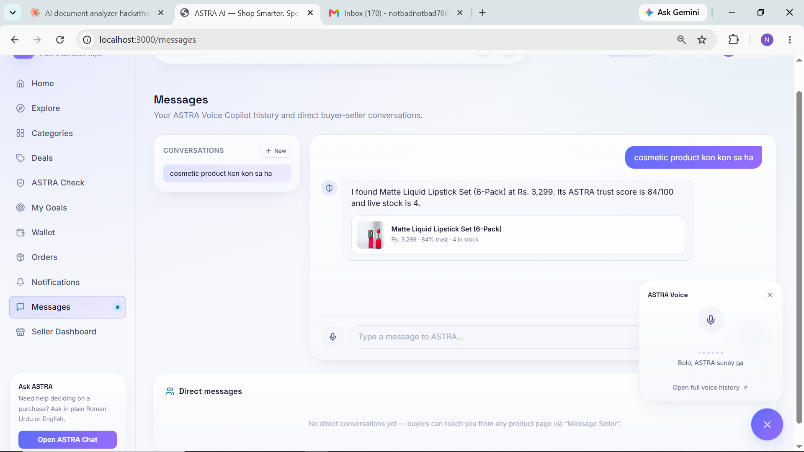
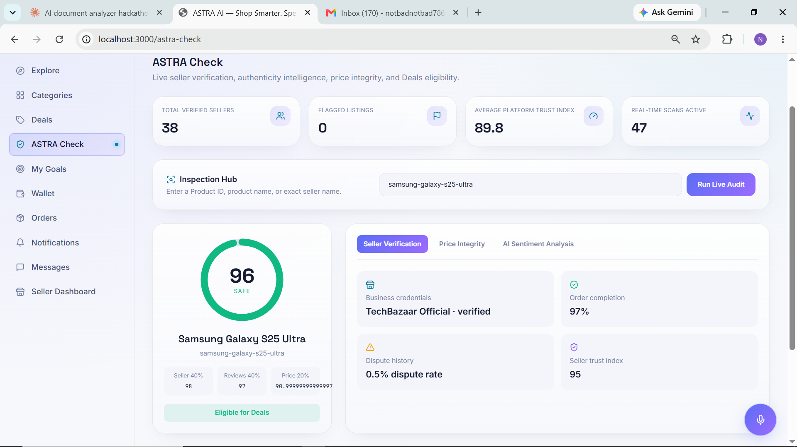
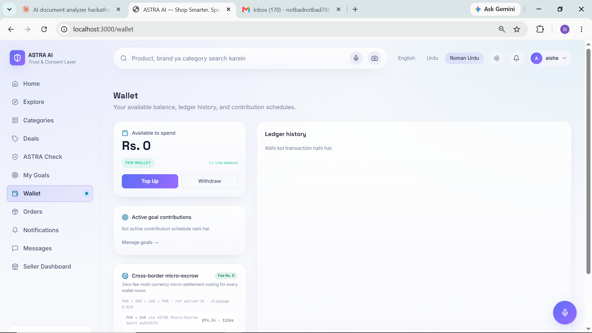

<div align="center">

# ASTRA AI
### The Trust & Financial-Consent Layer for Agentic Commerce

**"Shop Smarter. Spend Safer."**

Built for the **Alibaba Cloud AI Hackathon Pakistan 2026**
*Alkhidmat Foundation Pakistan × Bano Qabil Platform — AI for Pakistan's Future*

[](#testing--quality)
[](#testing--quality)
[](#testing--quality)
[](#tech-stack)
[](#tech-stack)
[](#tech-stack)
[](#tech-stack)
[](#license)

[Live Demo](#) · [Video Walkthrough](#) · [Report a Bug](../../issues) · [Request a Feature](../../issues)

</div>

---

## Table of Contents

- [The Problem](#the-problem)
- [The Solution](#the-solution)
- [Platform at a Glance](#platform-at-a-glance)
- [Core Features](#core-features)
- [Why ASTRA Wins](#why-astra-wins)
- [Tech Stack](#tech-stack)
- [Architecture](#architecture)
- [Project Structure](#project-structure)
- [Getting Started](#getting-started)
- [For Judges — Demo Access Notes](#for-judges--demo-access-notes)
- [Testing & Quality](#testing--quality)
- [API Overview](#api-overview)
- [Screenshots](#screenshots)
- [Roadmap](#roadmap)
- [Security](#security)
- [Team](#team)
- [License](#license)

---

## The Problem

AI agents are starting to shop, negotiate, and check out on our behalf — but agentic commerce today has **no trust layer**. That gap shows up in four places:

- **Counterfeit & synthetic-media fraud** — listings have no way to prove they're genuine.
- **Opaque pricing** — buyers in emerging, PKR-denominated markets have no autonomous agent negotiating fairly for them.
- **Slow disputes** — resolution takes days to weeks, with buyer funds locked in escrow and no transparent reasoning.
- **Budget blindness** — nothing stops an AI agent from overspending against a shopper's monthly limit.

## The Solution

ASTRA AI is a full-stack agentic-commerce platform that inserts a **Trust & Financial-Consent layer** between the buyer and every monetary action:

| Every... | ...is protected by |
|---|---|
| Checkout | Amount-bound, single-use financial consent (voice-biometric phrase or 6-digit OTP) |
| Listing | A cryptographic authenticity proof (SHA-256 fingerprint, ZK verification, Ed25519 stamp, deepfake scan) |
| Price | An autonomous Agent-to-Agent (A2A) negotiator streaming buyer-vs-seller rounds live over WebSocket |
| Dispute | An AI risk engine that resolves in under 30 seconds with a timestamped, auditable reasoning trail |
| Budget | A guardrail agent that blocks, warns, or suggests installments before money moves |

> **Vision:** Make AI-executed commerce verifiable, consented, escrowed, and self-healing.

## Platform at a Glance

<div align="center">

| 18 | 21 | 7 | 9 | 18 | 22 | 104/104 | 9 |
|:--:|:--:|:--:|:--:|:--:|:--:|:--:|:--:|
| Frontend Routes | API Endpoint Modules | WebSocket Channels | Alembic Revisions | Model Modules | Backend Services | Backend Tests Passing | E2E Scenarios |

*All figures above were verified directly against the repository on 3 September 2026 (route files, endpoint modules, and a live `pytest` run — see [Testing & Quality](#testing--quality)).*

</div>

## Core Features

### 🤝 A2A Autonomous Negotiation
Buyer and seller agents negotiate live over `WS /ws/negotiation/{product_id}` — alternating offer/counter rounds, converging within 6 rounds, every session and round persisted for full auditability. Optionally upgrades to a live Groq LLM seller agent, with a safe deterministic-rules fallback that never counters below the seller's floor.

### 🎙️ Voice-to-Action Checkout
Speak "*mujhe samsung phone kharido 150 hazar tak*" — ASTRA parses the action, a Roman-Urdu-aware budget ("hazar", "k", "lakh"), and a category, then deep-links straight to checkout with the consent modal pre-launched. Non-purchase speech falls back to normal semantic search.

### 🔐 Zero-Knowledge Proof & Cryptographic Stamp
Every listing carries a Groth16/BN254 ZK verification, a 32-hex seller reputation hash, and an Ed25519-signed cryptographic stamp — surfaced as a "Verified" badge on trustworthy listings.

### 🛡️ Deepfake Guardrail
An AI Synthetic Image Scan (AstraGuard-ViT-L/14) reports a manipulation-probability score and verdict on every listing image.

### 📈 Predictive Restock Guardian
Per-product purchase-interval modeling predicts the next likely purchase date, urgency, confidence, and estimated next price.

### 🌍 Cross-Border Micro-Escrow
A deterministic, zero-fee, three-hop settlement corridor (PKR → corridor currency → USD → PKR) with live per-hop rate/latency.

### 🗣️ Multilingual, Code-Switched Understanding
Roman Urdu, Punjabi, and English are understood interchangeably across search, voice intent, and negotiation — ASTRA's core differentiator for PKR-denominated, code-switching markets.

### Supporting pillars
ASTRA Check (rules-vs-LLM contradiction monitor) · Budget Guardrail Agent · Multi-modal Explore (text/voice/image with fusion) · Seller↔Buyer live messaging · Self-Healing Fallback Engine with a visible recovery log.

## Why ASTRA Wins

| Judge Criterion | ASTRA's Answer |
|---|---|
| **Originality** | First platform to treat financial consent as a first-class primitive of agentic commerce |
| **Technical depth** | 18 routes, 21 endpoint modules, 40+ REST routes, 7 WebSocket channels, pgvector + HNSW, Alembic migrations, escrow ledger with DB-level invariants |
| **AI sophistication** | Multi-agent swarm, A2A negotiation, Roman-Urdu-aware intent parsing, a risk engine, predictive restock — all with auditable reasoning trails |
| **Real-world impact** | Purpose-built for PKR-denominated emerging-market commerce: budget guardrails, zero-fee FX corridors, instant refunds |
| **Engineering rigor** | 104 pytest cases passing (verified) + a 9-scenario Playwright E2E suite, 4-job CI pipeline, production config validators, immutable audit trail |
| **Demo wow-factor** | Live WebSockets throughout — negotiation, wallet, deals, and disputes all update on screen in real time |

## Tech Stack

| Layer | Technology |
|---|---|
| Frontend framework | Next.js 14.2 (App Router), SSR + client islands, middleware auth |
| UI language | TypeScript 5.5, strict typing shared with backend schemas |
| UI library | React 18.3, hooks-driven realtime state |
| Styling | Tailwind CSS 3.4 with a custom design-token system |
| Motion | framer-motion 11.18 |
| Backend framework | FastAPI 0.115, 21 endpoint modules, 40+ REST routes, OpenAPI docs |
| ORM / validation | SQLAlchemy 2.0 + Pydantic v2 |
| Language | Python 3.12 |
| Primary database | PostgreSQL (+ SQLite for local/CI test runs) |
| Vector search | pgvector (HNSW cosine index) for product semantic embeddings |
| Migrations | Alembic — 9 ordered revisions |
| Realtime | Raw WebSockets — negotiation, deals, wallet, notifications, orders, pipeline, messages |
| Auth | JWT + email OTP two-factor |
| CI/CD | GitHub Actions — backend tests, frontend build, E2E, Docker build (4 jobs) |

## Architecture

```
┌─────────────────────┐        ┌──────────────────────┐        ┌─────────────────────┐
│   Next.js Frontend    │  REST  │   FastAPI Backend      │  SQL   │   PostgreSQL          │
│   18 routes, SSR      │◄──────►│   40+ endpoints         │◄──────►│   + pgvector (HNSW)   │
│   TypeScript + React  │  WS    │   21 endpoint modules   │        │   Alembic migrations  │
└─────────────────────┘◄──────►└──────────────────────┘        └─────────────────────┘
                          7 live WebSocket channels:
             negotiation · deals · wallet · notifications · orders · pipeline · messages
```

Consent, authenticity, negotiation, escrow, and dispute resolution are each an independent engine under `astra-backend/app/services/`, composed by a `consent_orchestrator` into one Overall Verdict per transaction.

## Project Structure

```
Astra_ai/
├── app/                        # Next.js App Router pages (Home, Explore, Categories, Deals,
│                                #   ASTRA Check, Goals, Wallet, Orders, Messages, B2B, Product)
├── components/                 # React components (TopBar, ExploreClient, GlobalVoiceFab, ...)
├── lib/                        # Typed API client, shared types, hooks
├── astra-backend/
│   ├── app/
│   │   ├── core/                # config, database, security, rate limiting
│   │   ├── models/               # 18 SQLAlchemy table modules
│   │   ├── schemas/              # Pydantic request/response contracts
│   │   ├── services/             # 22 business-logic engines (trust, finance, negotiation, explore...)
│   │   ├── realtime/             # WebSocket managers
│   │   └── api/v1/endpoints/     # 21 modules: auth, home, explore, deals, cart, wallet, goals,
│   │                             #   orders, astra_check, negotiation, b2b, chat, messaging, seller...
│   ├── tests/                    # pytest suite — 104 tests
│   └── alembic/versions/         # 9 Postgres migration revisions
├── e2e/                         # Playwright end-to-end specs — 9 scenarios
└── docker-compose.prod.yml
```

## Getting Started

### Prerequisites
- Node.js 18+ and npm
- Python 3.12+
- PostgreSQL (or use the included Docker Compose stack; SQLite works for local test runs)

### Backend

```bash
cd astra-backend
python -m venv .venv
source .venv/bin/activate          # Windows: .venv\Scripts\activate

pip install -r requirements.txt
cp .env.example .env               # set DATABASE_URL + SECRET_KEY at minimum

python -m alembic upgrade head     # PostgreSQL only; SQLite uses runtime migrations
python -m app.db.seed              # idempotent demo data (see credentials below)

uvicorn app.main:app --reload
```

API docs: `http://localhost:8000/docs`

### Frontend

```bash
npm install
cp .env.local.example .env.local   # set NEXT_PUBLIC_API_URL
npm run dev
```

Open `http://localhost:3000`

### Docker (full stack)

```bash
docker compose -f docker-compose.prod.yml up --build
```

## For Judges — Demo Access Notes

To keep the demo self-contained (no real SMTP/SMS provider configured), please note the following before evaluating:

### Demo login credentials (seeded automatically by `python -m app.db.seed`)

| Role | Email | Password |
|---|---|---|
| Buyer | `aisha@astra.ai` | `demo1234` |
| Seller (multiple stores) | `seller@astra.ai`, `laptophub-pk@astra.ai`, `audionest@astra.ai`, etc. | `demo1234` |

### ⚠️ OTP will not arrive by email/SMS in this environment
Login and signup require a 6-digit OTP after the password step. Because no real email/SMS provider is configured for the demo, the code is **never actually delivered** — this is expected, not a broken flow.

- **Dev/demo OTP code: `123456`** — always works while `OTP_DEBUG_LOG=true` (the default outside production).
- This is gated in `app/core/config.py` / `app/api/v1/endpoints/auth.py` and is **automatically disabled the instant `APP_ENV=production`** — it cannot be used to bypass OTP on a live deployment.
- Alternatively, run with `OTP_DEBUG_LOG=true` and check the backend console — the generated code is logged there instead of emailed.

We're flagging this explicitly so judges aren't stuck at the OTP screen — it's a deliberate, environment-gated hackathon shortcut, not an undocumented backdoor.

### Suggested 3-minute demo flow
1. **Voice login intent** — say *"mujhe samsung phone kharido 150 hazar tak"*; intent is parsed, product opens with the OTP consent modal pre-launched.
2. **A2A negotiation** — open the AI Negotiator on a product and watch buyer/seller agents converge round-by-round with a live progress bar.
3. **Trust stack** — Authenticity tab shows the ZK proof (Groth16), Ed25519 stamp, seller reputation hash, and a 0% deepfake-manipulation result.
4. **Swarm & escrow** — order drawer shows the ASTRA Swarm Log (3 parallel agents); trigger a dispute and watch it resolve in ~2.5 seconds with escrow auto-refunded live over WebSocket.
5. **Guardians** — `/goals` shows Predictive Restock Alerts; `/wallet` shows zero-fee cross-border micro-escrow hops; bottom-left panel shows the Self-Healing Engine log.

## Testing & Quality

```bash
# Backend — verified: 104 passed, 0 failed
cd astra-backend
python -m pytest tests/ -q

# Frontend
npx tsc --noEmit                    # strict type-check
npm run build                       # production build, 18 routes

# End-to-end (9 scenarios across core flows + showcase widgets)
npm run test:e2e
```

CI runs all of the above automatically on every push via a 4-job GitHub Actions pipeline (backend tests → frontend build → E2E → Docker build). Run the suites locally before your final submission commit to confirm green status on your machine.

## API Overview

| Area | Example endpoint | Notes |
|---|---|---|
| Auth | `POST /api/v1/auth/login`, `/auth/verify-otp` | JWT + email OTP 2FA |
| Explore | `POST /api/v1/explore/search`, `/explore/intent` | Text, voice, image, and fused multimodal search |
| Negotiation | `WS /ws/negotiation/{product_id}` | Live A2A buyer/seller rounds |
| Wallet | `GET /api/v1/wallet/micro-settlements` | Zero-fee cross-border escrow |
| Budget | `GET /api/v1/budget/dashboard` | Restock forecasts, goal matches |
| ASTRA Check | `GET /api/v1/astra-check/...` | Trust inspection, contradiction monitor |
| Orders | `POST /api/v1/orders/{id}/dispute` | Sub-30-second AI dispute resolution |

Full interactive reference: `http://localhost:8000/docs` (Swagger/OpenAPI) once the backend is running.


## Screenshots

### 🏠 Home



### 🔎 Multimodal Explore



### 🤖 AI Chatbot



### 🔐 Trust & Authenticity



### 💰 Wallet



## Roadmap

The showcase engines are deterministic, reproducible simulations built for judging; the negotiation path optionally upgrades to a live Groq LLM when an API key is provided. Scoped, identified next steps toward production:

- [ ] Real SMTP delivery for OTP email
- [ ] Stripe Elements UI for card top-ups
- [ ] Redis-backed distributed rate limiting
- [ ] Scheduled off-site database backups
- [ ] Server-side speech-to-text / real vision provider for open-vocabulary multimodal search

None of these affect the integrity of the current test suite or demo.

## Security

This repository is public for hackathon submission purposes.

- `.env` and `.env.*` are git-ignored; only placeholder `*.example` files (`.env.local.example`, `.env.production.example`, `astra-backend/.env.example`) are committed.
- No API keys, tokens, passwords, or real credentials are present anywhere in the tracked codebase.
- The dev OTP code documented above is a testing convenience only — it is inert whenever `APP_ENV=production` and is never a production credential.
- Production configuration validators refuse a default `SECRET_KEY` and force debug/OTP-logging off outside development.

## Team

| Name | 
|---|---|
| Aisha Amir Khan | 
| Syeda Gullay Zahra | 

## License

Distributed under the MIT License. See [`LICENSE`](LICENSE) for details.

---

<div align="center">

**ASTRA AI — Shop Smarter. Spend Safer.**

Built for the Alibaba Cloud AI Hackathon Pakistan 2026 · Alkhidmat Foundation Pakistan × Bano Qabil

</div>
